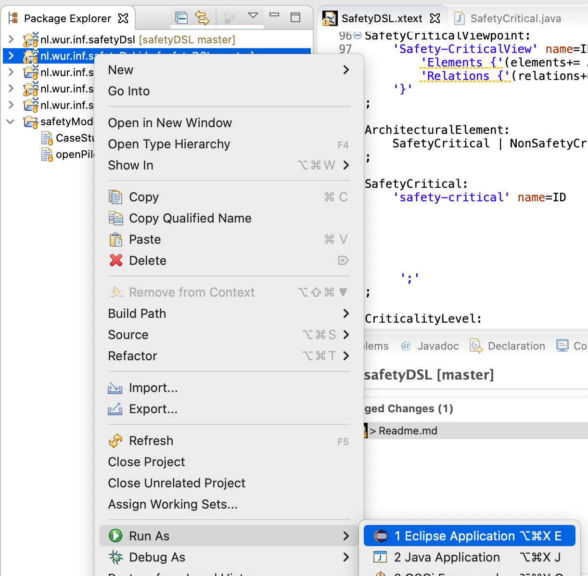

Safety DSL is built by leveraging [Xtext](https://www.eclipse.org/Xtext/), a language development framework provided as an Eclipse plug-in. The DSL is defined Xtext, we wrote our code generator using Xtend provided in Xtext framework for the safety DSL. Xtext and the corresponding code generator creates the parser and runnable language artifacts. From these artifacts, Xtext generates a full-featured Eclipse text editor. 

Here is a screenshot from the text editor: 

Tool Setup and Run
- Clone this repo
- Install [Eclipse EMF](https://www.eclipse.org/downloads/packages/release/2022-06/r/eclipse-modeling-tools)
- Install [Xtext plugin](https://www.eclipse.org/Xtext/download.html) on Eclipse
    - Go to Help > Install New Software > Add > Enter one of the listed Update sites in [Xtext plugin](https://www.eclipse.org/Xtext/download.html)
    - Install Xtext SDK
    - 
- Open the repo within Eclipse Ide
- Generate language artifacts from `nl.wur.inf.safetyDsl/src/nl/wur/inf/GenerateSafetyDSL.mwe2 > Right click > Run as > MWE2 Workflow` 

- Run ide project by `nl.wur.inf.safetyDsl.ide > Right click > Run as > Eclipse Application`. This will start a new instance of Eclipse. From this, create a Java project and in src folder copy the [safety model file](https://github.com/havvagulay/safetyDsl/blob/master/safetyModel/openPilotAlertManager.safety) and save it. The python scripts will be generated. Run the scripts to get results. 

