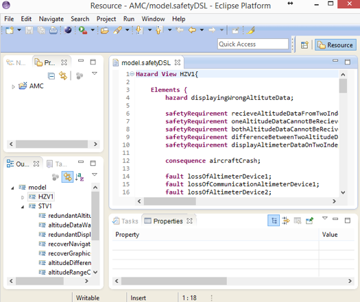
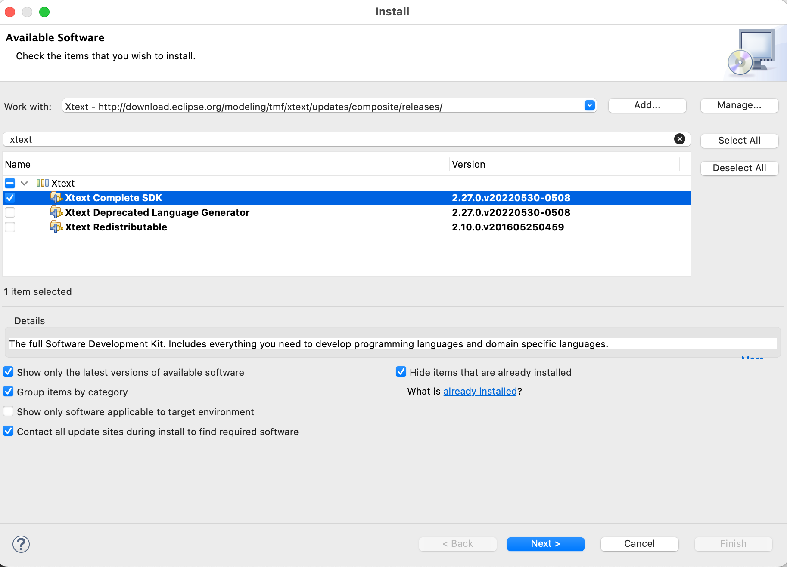
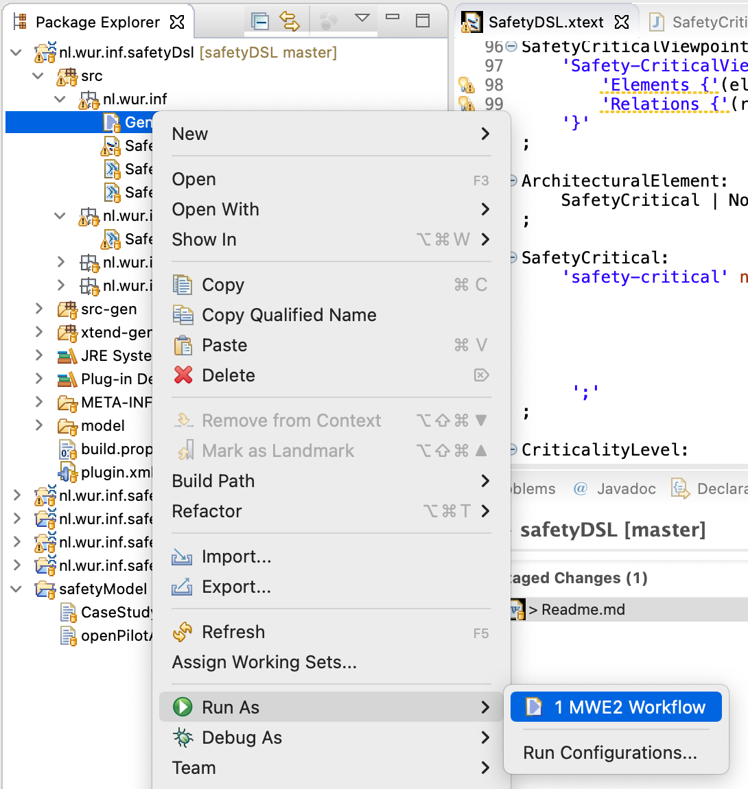

# Overview
Safety DSL is built by leveraging [Xtext](https://www.eclipse.org/Xtext/), a language development framework provided as an Eclipse plug-in. The DSL is defined Xtext, we implemented our code generator using Xtend from Xtext framework for the safety DSL. Xtext and the corresponding code generator create the parser and runnable language artifacts. From these artifacts, Xtext generates a full-featured Eclipse text editor for our DSL. 

Here is a screenshot from the text editor: 

# Tool Setup and Run on Sample Use Case
- Clone this repo
- Install [Eclipse EMF](https://www.eclipse.org/downloads/packages/release/2022-06/r/eclipse-modeling-tools)
- Run Eclipse downloaded in previous step
- Install [Xtext plugin](https://www.eclipse.org/Xtext/download.html) on Eclipse
    - Go to Help > Install New Software > Add > Enter one of the listed Update sites for [Xtext plugin](https://www.eclipse.org/Xtext/download.html)
    - Install Xtext SDK
    - 
- Open the repo within Eclipse Ide
- Generate language artifacts from `nl.wur.inf.safetyDsl/src/nl/wur/inf/GenerateSafetyDSL.mwe2 > Right click > Run as > MWE2 Workflow` 

- Run ide project by `nl.wur.inf.safetyDsl.ide > Right click > Run as > Eclipse Application`. This will start a new instance of Eclipse. From this, create a Java project and in src folder copy the [safety model file](https://github.com/havvagulay/safetyDsl/blob/master/safetyModel/openPilotAlertManager.safety) and save it. The python scripts will be generated. Run the scripts to get results for the sample case study.

## Sample Case Study
- Clone [Openpilot](https://github.com/havvagulay/openpilot) project on to your machine. This is a fork of the actual [Openpilot](https://github.com/commaai/openpilot) project of the time when we applied our fault-based testing approach.
    - Follow the instructions given [here](https://github.com/commaai/openpilot/blob/master/tools/README.md) to install and run Openpilot. 
- You can run the generated scripts in the previous section to get results from mutant generation and test case execution.
    - Follow the instructions given [here](https://github.com/mutpy/mutpy#installation) to install and run MutPy.
